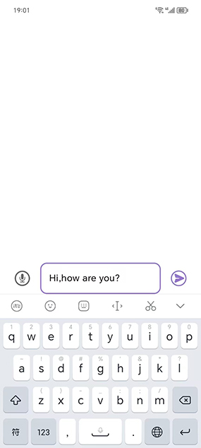
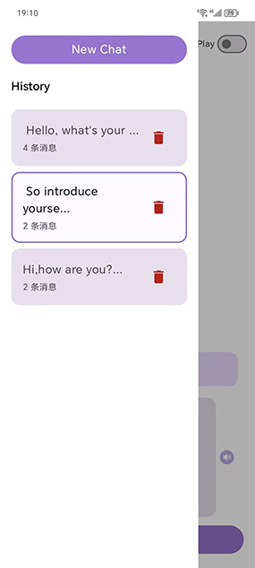
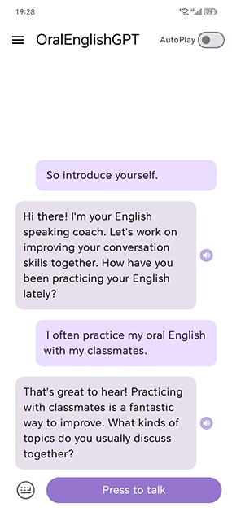
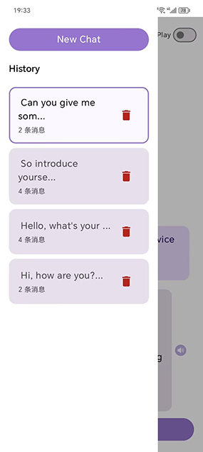
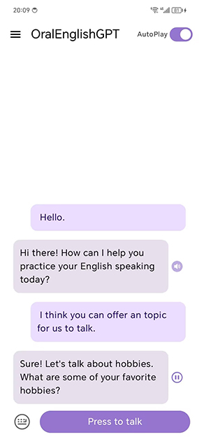
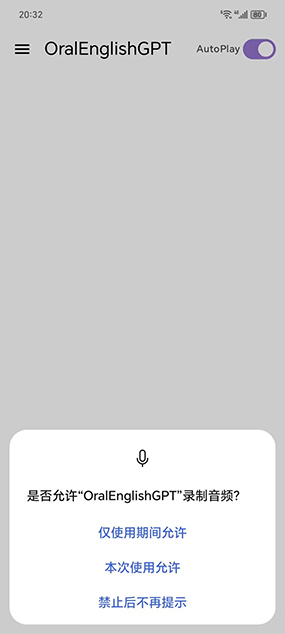
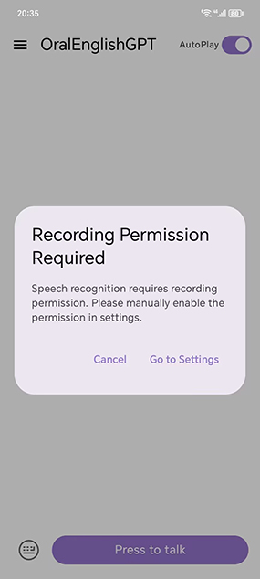

OralEnglishGPT

OralEnglishGPT 是一款类大模型客户端的 app，旨在帮助用户进行英语口语和听力的练习。

Github仓库地址：https://github.com/Cubicheng/OralEnglishGPT

## 1 App 的运行与开发环境

（1）运行环境：7.0 以上版本 Android 的 Android 手机/平板

（2）部署方法：直接安装 OralEnglishGPT.apk 即可

（3）开发环境：Android Studio 2024.2.2 Patch 2，windows11 22H2

（4）手写代码行数：手机端约 1377 行（Java/Kotlin）

## 2 App 功能说明

### （1）系统功能分解

#### a.大模型交互

主界面中，用户可以与一个大模型进行交互，交互方式有键盘输入以及语音输入两种。

#### b.大模型发音

对于大模型的回复，提供一个播放按钮，使用语音合成功能播放大模型的回复，实现更接近真人的对话体验，并有一个 AutoPlay 开关控制是否自动播放。

#### c.历史记录存储

侧边栏中存储对话的历史记录，并提供新建对话、切换对话、删除对话功能。

### （2）UI设计方案与人机交互特性

界面基本仿照常见的大模型客户端设计。

#### a.主界面

上方是 topbar，左上角是侧边栏的打开按钮，右上角是 AutoPlay 控制开关

中间部分是消息部分，下方是输入部分，点击键盘或者话筒小图标可以在键盘输入和语音输入之间切换

#### b.输入部分

默认输入方式为语音输入，因为希望用户在条件允许的情况下使用语音输入。

语音输入部分，在用户按下 “Press to talk” 按钮后，按钮会变为灰色且不可点击，并显示一个加载圈圈以及 “Speaking” ，提示用户说话，检测到用户说话结束之后会自动发送消息。

键盘输入部分，输入框内初始写着 “Input text …” 提示用户输入，用户聚焦会使用主题色高亮输入框，输入完成后按下发送按钮即可，此时输入框自动清空。

#### c.侧边栏部分

按下 topbar 左侧的菜单按钮或者使用从左向右的滑动手势，即可呼出左侧的侧边栏，侧边栏主要负责历史记录的存储，使用主题色边框高亮当前选中对话。刚进入 app 时，默认用户想要进行新对话，所以当前对话为一个空白的新对话，没有历史对话被选中。

上图：刚进入app时的侧边栏，没有历史对话被选中

点击其中一个对话，可以跳转到这个对话，因为用户下一步逻辑应该是要查看自己选择的对话的完整内容并进行进一步的对话，所以侧边栏会自动缩回。此时如果再次打开侧边栏，会发现高亮了当前所在的对话。

上图：选择历史对话后，侧边栏自动缩回

上图：打开侧边栏，发现当前所在对话被高亮

如果继续了当前所选择对话，当前所选择对话的最后修改时间就会被修改，其在历史记录中的位置会被移动到顶部，因为历史记录中的对话被设计成按照最后修改时间来排序，这样设计的理由是一个对话，如果用户经常去拓展这段对话，说明用户对这个对话的兴趣很高，大概率经常点击，所以放到用户方便点击的位置。

上图：选择历史对话并继续对话

上图：历史记录中，当前对话被置顶

如果点击 “New Chat” 按钮，会创建新对话，此时用户应该也是想进行对话，所以侧边栏自动缩回，同时用户进入一个空白的新对话，和刚进入app时的状态是一样的。

上图：点击 “New Chat” 后会来到一个空白的新对话

如果在空白新对话中发送消息，那么这个对话就会被记录到历史对话中去，并且排在最上面，因为是最新修改的对话。

上图：在空白新对话中发送消息

上图：新对话被加入消息历史中

想要删除历史对话，点击删除按钮即可，会弹出一个警告对话框，点击确认即可删除。

上图：点击删除按钮

上图：点击确认之后，对话被删除（如果是当前所在对话被删除，会自动进入一个空白的新对话）

#### d.播放按钮部分

点击播放按钮，会使用语音合成功能播放大模型的回复消息，此时播放按钮变成了停止按钮，点击可以停止播放。

上图：点击了最后一个回复的播放按钮，此时正在播放最后一个回复的语音合成

如果开启了AutoPlay，会自动播放最新出现的那一个回复。同时，如果按下 "Press to talk"，会强制停止语音合成的播放，防止干扰用户的语音输入。

## 3 App架构设计及技术实现方案

总览

database 包负责数据库的实现，其中三个实体分别是 对话历史记录缩写、对话历史记录实际内容、AutoPlay 参数。

gpt 包使用 Retrofit 实现了智谱清言的 api 调用，以及一些基础 data class 的定义。

theme 包中定义主题色。

ui 包中是所有 compose 的 ui。

utils 包中是一些不好归类的类。

viewmodel 包中是所有的 viewmodel，处理 ui 底层的数据逻辑。其中语音合成（tts）使用的是安卓本地原生 tts（因为科大讯飞的英语 tts 要钱），语音识别（stt）使用的是科大讯飞的 sdk 。

## 4 技术亮点以及异常处理

### 技术亮点

使用 jetpack compose 完成了整体 app 的搭建，ui 和逻辑分离

使用 Retrofit 实现 api 调用，响应速度快

集成 Room 数据库管理历史对话记录，采用 ACID 事务保障数据可靠性

使用科大讯飞 stt 的 sdk ，准确度高，响应速度快。

整体ui简洁明快，人机交互逻辑友好，并通过 Material3 实现了黑夜主题热切换。

###   权限处理部分

本 app 需要录音权限，首次点击 “Press to talk” 会向用户请求麦克风权限：

上图：申请录音权限

但是如果用户选择了 “禁止后不再提示” ，之后再次点击 “Press to talk” 就无反应，所以我手写了一个对话框引导用户前往设置授予权限：

上图：选择“禁止后不再提示”后的处理逻辑，点击 “Go to Settings” 打开应用设置

上图：点击 “Go to Settings” 打开的应用设置

### 网络异常部分

本 app 需要网络连接来与大模型对话，如果没有网络连接，在进入 app 、按下录音按钮、按下消息发送按钮时，都会提示用户：

## 5 总结

经过本学期的学习，我最大的感触就是安卓开发不同于 java 开发，java 开发可以选择从零开始搭建一个项目，而安卓开发是在一个巨大而又繁琐的架构之上，搭建自己的项目，所以需要去了解很多现有的接口，难度反而提高了不少。不过个人感觉这种“在别人搭建好的地基之上盖自己的房子”的开发模式，更加符合实际工作中的开发模式，因为不可能所有项目都是自己来开发的，而且就算是在公司自研的某些项目，也会有团队合作的存在，也需要去了解“别人搭建好的地基”。所以我觉得这也是一种必要的锻炼了。第一次写这种一堆集成组件的项目，还挺好玩的。

补充说明一下，附送的代码工程文件中我删除了大模型的 apikey ，无法直接运行，但是 apk 是可以直接安装使用的。同时，由于token 限制，目前采用的方案的是三轮上下文+一个英语口语老师的 prompt ，大模型体验效果较差。同时，由于科大讯飞不提供免费的英文tts ，所以使用的是安卓原生的 tts ，效果不是很理想。不过本 app 主要是注重于整体的框架开发，这种接口后续有更好的可以很快替换。目前已在荣耀手机、红米手机、华为手机、小米平板上实测功能完整，尚未知晓其他机型是否会存在无法启动原生tts的服务的问题。